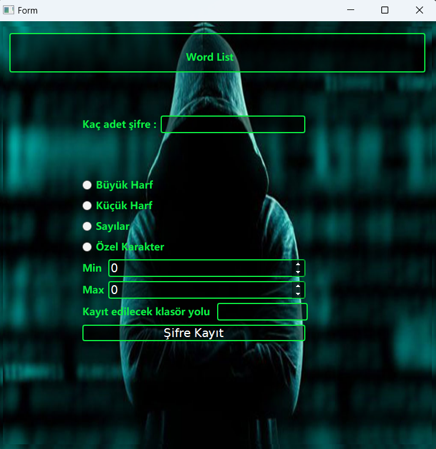

# Random-Password-Generator
 
This Python program is developed to generate a random password list.
### Features
• Generating random passwords

• Determining the number of passwords

• Specifying password composition (uppercase letters, lowercase letters, special characters, numbers)

• Setting the password length
### How to use
1. Run the program.
2. Determine the number of passwords.
3. Specify the password content.
4. Set the password length.
5. Write the directory where the password list will be saved.(Example: C/Desktop/)
   
``` python rastgele_sifre_olusturucu.py ```
### Requirements
• Python 3.x
# Setup
### 1. Clone the repo:
```git clone https://github.com/oguzhanerbil/Random-Password-Generator.git```
### 2. Go to the project directory:
```cd Random-Password-Generator```
### 3. Run the program:
```python start.py```
### Contributing
1. Fork this project (click on the "Fork" button in the top right corner).
2. Add new features or fix bugs.
3. Commit your changes (`git commit -m 'Added new feature'`).
4. Publish your changes to your fork (`git push origin branch-name`).
5. Create a Pull Request.
### Licence
This project is licensed under the MIT License. Please refer to the LICENSE file for details.

